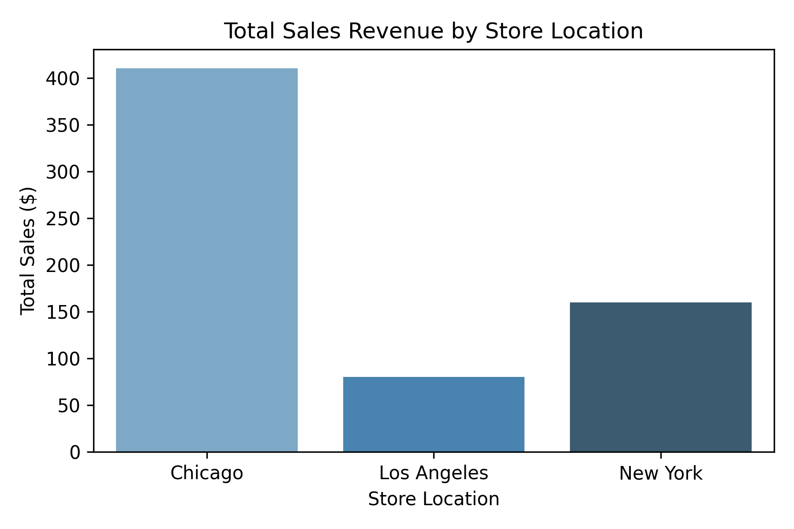

# 🏬 Retail Store Sales Performance & Analytics Pipeline

---

## 📌 1. Project Overview
This project focuses on building an end-to-end data analytics architecture designed to evaluate transactional behavioral patterns across multi-regional brick-and-mortar stores. By processing real-time mock data, this workflow identifies key revenue channels, highlights underlying data quality gaps, and isolates localized consumer checkout trends. The ultimate goal is to provide corporate stakeholders with actionable insights to lower credit card fees and scale marketing resources efficiently.

---

## 📂 2. Project Structure
This directory follows an organized framework to ensure clear file separation and modular development practices:

```text
├── retail-store-sales-analysis/  <- Main root project folder
│   ├── README.md                 <- Professional presentation report page
│   ├── retail_sales.csv          <- Cleaned spreadsheet dataset
│   ├── location_sales.png        <- Regional store performance chart image
│   └── payment_methods.png       <- Customer payment split pie chart image
```

---

## 📊 3. Datasets Options
The analysis is driven by an enterprise-structured transactional dataset containing real-world anomalies.

* **Primary Dataset File:** `retail_sales.csv`
* **Data Dimensions:** Includes customer demographics, granular pricing attributes, checkout quantities, store geolocations, and transactional identifiers.
* **Data Properties handled:** Contains missing rows (`Null` inputs) and price variations designed to validate advanced conditional logic cleaning.

---

## 💻 4. Software Installation Option
To explore, edit, or reproduce this project, you can choose between two development options:

* **Option A (No Installation Required - Recommended):** Run the project directly in your web browser via **Google Colab**. This cloud tool eliminates the need for any local computer configuration.
* **Option B (Local Environment Setup):** Install the **Anaconda Distribution** on your local machine to launch a local instance of **Jupyter Notebook**.

---

## 📦 5. Install Dependencies
If running locally, you must install the required core data manipulation and visual visualization libraries. Open your command terminal (or a cell inside your notebook) and run:

```bash
pip install pandas matplotlib seaborn
```

---

## ⚙️ 6. Methodology
This workflow follows a rigid data analyst lifecycle path to ensure data integrity:
1. **Data Ingestion:** Mock streams are aggregated and transformed into structural tabular formats via Pandas DataFrames.
2. **Data Cleaning:** Missing structural fields are targeted. Missing unit prices are mathematically reconstructed via aggregate calculation loops (`TotalAmount / Quantity`).
3. **Exploratory Data Analysis (EDA):** Grouping and sorting aggregations filter regional revenue baselines and electronic payment frequencies.
4. **Export Automation:** Results are pushed into distinct `.csv` database files and high-definition `.png` media files.

---

## 🖼️ 7. Visualizations Graphs Images
The outputs of the cleaning and analysis steps are visually compiled below:

### Figure 1: Regional Store Revenue Anchors
This bar chart tracks overall revenue metrics across key retail centers, exposing a distinct gap between leading distribution points and underperforming regions.



### Figure 2: Customer Checkout Channel Split
This pie chart details transaction category allocations, tracking cash pipelines against electronic processing gateways.


---

## 🛠️ 8. Technologies Used
* **Primary Language:** Python 3.11
* **Data Wrangling:** Pandas DataFrames
* **Scientific Computation:** NumPy Arrays
* **Data Visualization Engines:** Matplotlib Core & Seaborn Libraries

---

## 🔮 9. Description Summary & Future Improvements
In summary, this data pipeline transforms raw transactional text rows into dynamic corporate-ready summaries. While it successfully automates data validation and isolates key checkout preferences, the project can be scaled further. 

### Future Pipeline Improvements:
* **Database Integration:** Move from a flat `.csv` structure to a live relational relational schema by embedding native **PostgreSQL query logic** for faster processing.
* **Live Interactive Dashboards:** Migrate these static image graphs into dynamic **Power BI or Tableau dashboards** to allow users to filter metrics by time intervals.
* **Predictive Forecasting:** Introduce machine learning algorithms (like Linear Regression or Time Series Forecasting) to project next quarter's inventory needs based on current regional sales volumes.
